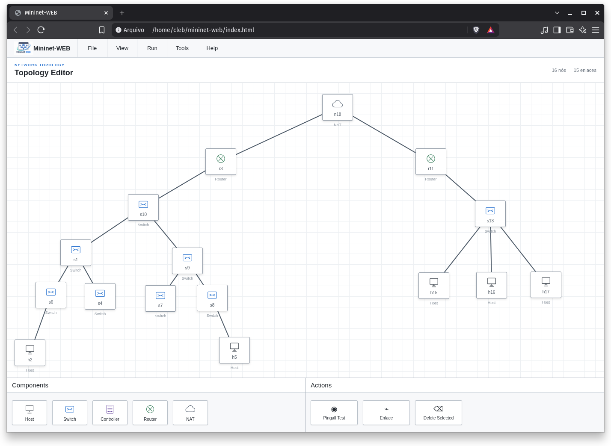

# Mininet-WEB

  

## Sobre

O **Mininet-WEB** é uma aplicação web para criação e gerenciamento visual de topologias de redes utilizando o **Mininet**.

A proposta é fornecer uma interface gráfica e interativa para que o usuário possa construir topologias de rede por meio de componentes visuais, como hosts, switches, roteadores e controladores.

## Interface

  

